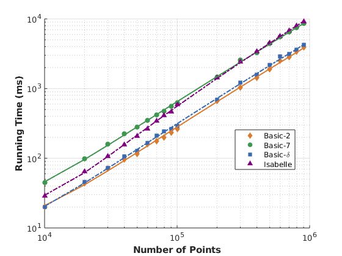

# Closest Pair of Points

This project contains the accompanying code of my Bachelor's Thesis. A formal proof of a divide-and-conquer algorithm for the Closest Pair of Points problem using Isabelle.

* Closest_Pair: verifies functional correctness
* Closest_Pair_Time: verifies the runtime bound of O(n log n)
* Closest_Pair_Code: sets up code export for the target languages Haskell, SML, Ocaml and Scala

The ocaml folder contains three implementations of the Closest Pair of Points algorithm in Ocaml and is used for benchmarking.

* mutable: a handwritten imperative implementation
* immutable: a handwritten functional implementation
* verified: the exported and verified code of Isabelle

Run the benchmarks with ```main.native to_file from to by```. E.g. ```main.native 10 false 1000 10000 1000``` runs the benchmarks 10 times for input sizes starting at 1000 points, increasing by steps of 1000 points to 10000 points and prints the averaged output to stdout.

The benchmark folder contains a matlab script the visualize the benchmarking results.

